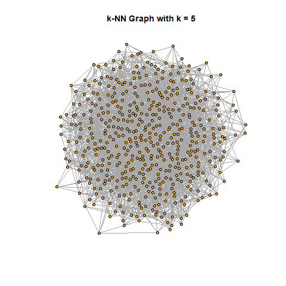

# gaia-graph-analysis
# Nearest-neighbor graph analysis of Gaia stellar data

This project investigates spatial structure in stellar position data using graph-based methods applied to a subset of the Gaia DR3 catalog.

# Objective

Construct nearest-neighbor graphs and analyze structural properties such as: 

- Graph connectivity
- Degree distribution
- Clustering behavior

We also compare results from real Gaia data to a synthetic baseline to highlight meaningful spatial structure.

# How to Run

1. Install dependencies:
   pip install pandas numpy matplotlib scikit-learn networkx astroquery

2. Open the notebook:
   notebooks/project2_gaia_knn_analysis.ipynb

3. Run all cells to reproduce results

# Methods

- Retrieved real Gaia DR3 data using astroquery
- Performed exploratory data analysis (EDA) using pandas and matplotlib
- Constructed k-NN graphs using scikit-learn
- Modeled graph structure using networkx
- Evaluated graph metrics across varying values of k

# Skills Demonstrated

- Data retrieval from APIs (astroquery / Gaia DR3)
- Exploratory Data Analysis (EDA)
- Graph theory and network analysis
- k-nearest neighbor algorithms
- Scientific computing with Python
- Data visualization

# Key Results

- As k increases, the graph becomes more connected and dense
- The number of connected components rapidly decreases, reaching a single connected component for moderate k
- Clustering coefficient increases and stabilizes, indicating stronger local structure
- Real Gaia data exhibits more meaningful spatial structure compared to synthetic uniform data

# Example Visualization

# Repository Structure

- data/ # Gaia dataset (CSV) 
- figures/ # Generated plots 
- notebooks/ # Jupyter notebook analysis (.ipynb) 
- reports/ # Final PDF and HTML reports 
- scripts/ # Supporting scripts (R / Python) 
- notes/ # Drafts and observations

# Tools and Libraries

- Python (Jupyter Notebook)
- pandas
- numpy
- matplotlib
- scikit-learn
- networkx
- astroquery

# Conclusion

This project demonstrates how graph-based methods can reveal meaningful spatial structure in astronomical datasets. The k-NN framework provides a flexible way to study connectivity, clustering, and density in stellar distributions.
